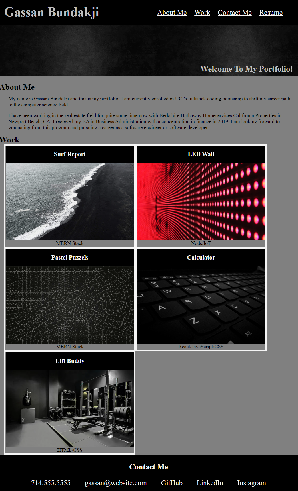

# Gassans Portfolio 🚀 

Welcome! 😊👋

## Description ⚡️

This webpage shows my personal portfolio and provides information about me, my work, my resume, and how to contact me. At the moment I dont have work to show so I have used placeholder links that will direct you to my GitHub profile. I plan on updating this and fixing it to show the most current work and information about myself and how to contact me. I created this portfolio webpage in order to show potential employers my skills (or lack there of) in HTML and CSS coding. 

## Usage ✔

Please visit my GitHub profile and click on the Gassn's-portfolio repsotiory to acess the assets and information about this project.

## Deployed Webpage 💻

https://gbundakji.github.io/gassans-portfolio/

## Visuals 📷

## Credits 📝

https://stackoverflow.com/
https://www.w3schools.com/
https://coding-boot-camp.github.io/full-stack/github/professional-readme-guide

## License 🔑
MIT License

Copyright (c) [2022] [Gassan-Bundakji]

Permission is hereby granted, free of charge, to any person obtaining a copy of this software and associated documentation files (the "Software"), to deal in the Software without restriction, including without limitation the rights to use, copy, modify, merge, publish, distribute, sublicense, and/or sell copies of the Software, and to permit persons to whom the Software is furnished to do so, subject to the following conditions:

The above copyright notice and this permission notice shall be included in all copies or substantial portions of the Software.

THE SOFTWARE IS PROVIDED "AS IS", WITHOUT WARRANTY OF ANY KIND, EXPRESS OR IMPLIED, INCLUDING BUT NOT LIMITED TO THE WARRANTIES OF MERCHANTABILITY, FITNESS FOR A PARTICULAR PURPOSE AND NONINFRINGEMENT. IN NO EVENT SHALL THE AUTHORS OR COPYRIGHT HOLDERS BE LIABLE FOR ANY CLAIM, DAMAGES OR OTHER LIABILITY, WHETHER IN AN ACTION OF CONTRACT, TORT OR OTHERWISE, ARISING FROM, OUT OF OR IN CONNECTION WITH THE SOFTWARE OR THE USE OR OTHER DEALINGS IN THE SOFTWARE..

## Project status 🏆
This project is still in progress.

